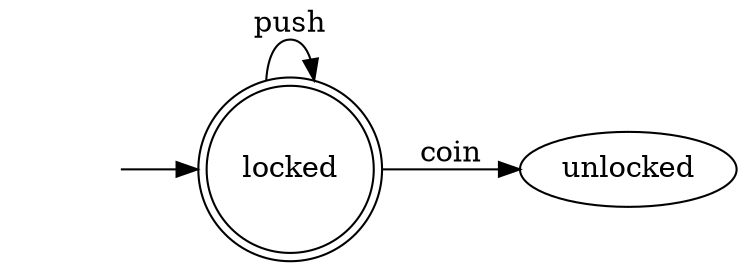
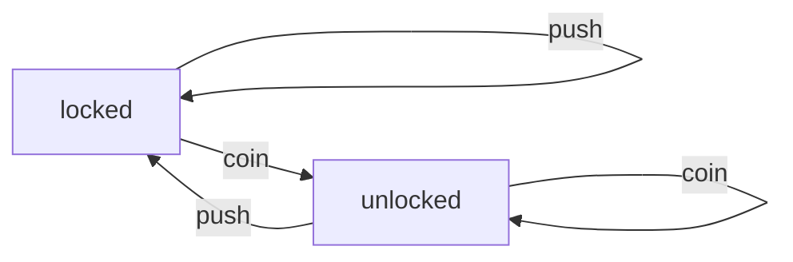

# F02 — Graph Foundations

## Overview

State machines are directed graphs. Trees are directed graphs. The codebase
already has a `directed-graph` package (used by the build system) and a
`state-machine` package (used by the lexer and branch predictor), but they
don't know about each other. The state machine reimplements graph algorithms
— BFS for reachable states, graph traversal for DOT visualization — that the
directed graph already provides.

This spec unifies them by extending the directed-graph package with three new
capabilities:

1. **Labeled edges** — `LabeledDirectedGraph` adds labels to edges, enabling
   state machine transitions (`add_edge("locked", "unlocked", label="coin")`)
2. **Visualization** — DOT (Graphviz), Mermaid, and ASCII output for any graph
3. **Tree** — A constrained directed graph with single-parent, no-cycle
   invariants for ASTs, DOM trees, and directory hierarchies

After these additions, the state-machine package is refactored to use
`LabeledDirectedGraph` internally, replacing hand-rolled BFS and DOT generation
with the directed-graph package's implementations.

## Layer Position

```
        Foundation Layer
        ┌──────────────────────────────────────────┐
        │  DirectedGraph (existing)                │
        │    ├── allow_self_loops flag (new)        │
        │    ├── LabeledDirectedGraph (new)         │
        │    ├── Visualization (new)                │
        │    └── Tree (new)                         │
        └──────────────┬───────────────────────────┘
                       │
         ┌─────────────┼──────────────────┐
         │             │                  │
    Build System   StateMachine (F01)   Future: AST
    (existing)     (refactored)         DOM Tree
```

**Depends on:** Nothing (standalone foundation).
**Used by:** `state-machine`, `build-tool`, future `parser` (AST as Tree),
future browser (DOM tree).

## Part 1: DirectedGraph — `allow_self_loops` Flag

### Problem

The existing `DirectedGraph` raises `ValueError` on self-loops
(`add_edge("A", "A")`). This made sense for the build system (a package
can't depend on itself), but state machines need self-loops — e.g., a turnstile
in the `locked` state stays `locked` when pushed.

### Solution

Add a constructor flag that defaults to `False`, preserving existing behavior:

```python
class DirectedGraph:
    def __init__(self, *, allow_self_loops: bool = False):
        self._allow_self_loops = allow_self_loops
        ...

    def add_edge(self, from_node, to_node):
        if from_node == to_node and not self._allow_self_loops:
            raise ValueError("Self-loops are not allowed")
        # ... rest unchanged
```

When `allow_self_loops=True`:
- `add_edge("A", "A")` succeeds
- `"A"` appears in its own `successors()` and `predecessors()`
- `has_cycle()` returns `True` (a self-loop IS a cycle)
- `topological_sort()` raises `CycleError` (correct — graphs with cycles
  have no topological ordering)

The build system never passes `allow_self_loops=True`, so it is completely
unaffected.

## Part 2: LabeledDirectedGraph

### What Is It?

A directed graph where every edge carries a **label**. Multiple edges between
the same pair of nodes are allowed if they have different labels (making it a
labeled multi-graph).

This is exactly what a state machine transition table is: an edge from state A
to state B labeled with event E.

### Why Not Just Add Labels to DirectedGraph?

The existing `DirectedGraph` uses sets for adjacency (`forward[A] = {"B", "C"}`),
which means at most one edge between any pair of nodes. A labeled graph needs
multiple edges (A→B on "coin" AND A→B on "token"). Changing the existing class
would break the build system. A new class preserves backwards compatibility.

### Internal Storage

```python
class LabeledDirectedGraph:
    def __init__(self):
        # Wraps a self-loop-enabled DirectedGraph for structural queries
        self._graph = DirectedGraph(allow_self_loops=True)
        # Label storage: (from, to) → set of labels
        self._labels: dict[tuple[str, str], set[str]] = {}
```

The inner `DirectedGraph` tracks which nodes are connected (ignoring labels).
The `_labels` dict tracks what labels exist on each edge pair. When the last
label is removed from an edge pair, the edge is also removed from the inner
graph.

### API

```python
class LabeledDirectedGraph:
    # --- Node operations (delegate to inner graph) ---
    def add_node(self, node: str) -> None: ...
    def remove_node(self, node: str) -> None: ...
    def has_node(self, node: str) -> bool: ...
    def nodes(self) -> list[str]: ...

    # --- Edge operations (labeled) ---
    def add_edge(self, from_node: str, to_node: str, label: str) -> None: ...
    def remove_edge(self, from_node: str, to_node: str, label: str) -> None: ...
    def has_edge(self, from_node: str, to_node: str,
                 label: str | None = None) -> bool: ...
    def edges(self) -> list[tuple[str, str, str]]: ...
    def labels(self, from_node: str, to_node: str) -> set[str]: ...

    # --- Neighbor queries (optional label filter) ---
    def successors(self, node: str, label: str | None = None) -> list[str]: ...
    def predecessors(self, node: str, label: str | None = None) -> list[str]: ...

    # --- Algorithms (delegate to inner graph, ignore labels) ---
    def transitive_closure(self, node: str) -> set[str]: ...
    def has_cycle(self) -> bool: ...
    def topological_sort(self) -> list[str]: ...

    # --- Access inner graph ---
    @property
    def graph(self) -> DirectedGraph: ...
```

### Behavior Details

- `add_edge("A", "B", "x")`: adds node A, node B (if needed), adds edge A→B
  to inner graph (if not present), adds "x" to `_labels[("A","B")]`
- `remove_edge("A", "B", "x")`: removes "x" from labels; if no labels remain,
  removes A→B from inner graph too
- `has_edge("A", "B")` (no label): returns `True` if ANY label exists
- `has_edge("A", "B", "x")`: returns `True` if that specific label exists
- `edges()`: returns `[(from, to, label)]` for every label on every edge pair
- `successors("A", label="x")`: returns nodes reachable from A on label "x"
- `successors("A")`: returns ALL successors regardless of label

## Part 3: Visualization Module

### Motivation

The state machine's `to_dot()` method generates Graphviz DOT strings by
manually iterating transitions. But DOT generation is a function of the
**graph**, not the state machine. Moving it to the directed-graph package
means any graph (labeled or not, state machine or dependency tree) can be
visualized.

### Formats

#### DOT (Graphviz)

```python
def to_dot(graph, *, name="G", node_attrs=None, edge_attrs=None,
           initial=None, rankdir="LR") -> str:
```

Produces output like:


- `node_attrs`: `dict[str, dict[str, str]]` — per-node DOT attributes
  (e.g., `{"q_accept": {"shape": "doublecircle"}}`)
- `edge_attrs`: `dict[tuple[str, str, str], dict[str, str]]` — per-edge attrs
- `initial`: if set, adds an invisible node with an arrow to the initial state

#### Mermaid

```python
def to_mermaid(graph, *, direction="LR", initial=None) -> str:
```

Produces:


Mermaid diagrams can be embedded directly in GitHub Markdown — no external
tools needed. This makes them ideal for README files and documentation.

#### ASCII Table

```python
def to_ascii_table(graph) -> str:
```

For unlabeled graphs: adjacency list format.
For labeled graphs: transition table format (like DFA's existing `to_ascii()`).

```
State      | coin      | push
-----------+-----------+----------
locked     | unlocked  | locked
unlocked   | unlocked  | locked
```

### State Machine Integration

After refactoring, the state machine's `to_dot()` and `to_ascii()` become thin
wrappers:

```python
# DFA.to_dot()
def to_dot(self) -> str:
    node_attrs = {s: {"shape": "doublecircle"} for s in self._accepting}
    return visualization.to_dot(self._graph, node_attrs=node_attrs,
                                initial=self._initial)

# DFA.to_ascii()
def to_ascii(self) -> str:
    return visualization.to_ascii_table(self._graph)
```

## Part 4: Tree

### What Is a Tree?

A tree is a directed graph with three constraints:
1. **Single root** — exactly one node has no parent (no predecessors)
2. **Single parent** — every non-root node has exactly one parent
3. **No cycles** — a consequence of (1) and (2), but worth stating

Edges point from parent to child: `parent → child`.

### Why Use Trees?

- **ASTs** — the parser produces abstract syntax trees
- **DOM tree** — an HTML document is a tree of elements
- **Directory tree** — file systems are trees
- **Decision trees** — ML models
- **Parse trees** — concrete syntax trees from grammar-driven parsing

### API

```python
class Tree:
    def __init__(self, root: str):
        self._graph = DirectedGraph()  # no self-loops needed
        self._graph.add_node(root)
        self._root = root

    # --- Mutation ---
    def add_child(self, parent: str, child: str) -> None: ...
    def remove_subtree(self, node: str) -> None: ...

    # --- Queries ---
    @property
    def root(self) -> str: ...
    def parent(self, node: str) -> str | None: ...
    def children(self, node: str) -> list[str]: ...
    def siblings(self, node: str) -> list[str]: ...
    def is_leaf(self, node: str) -> bool: ...
    def is_root(self, node: str) -> bool: ...
    def depth(self, node: str) -> int: ...
    def height(self) -> int: ...
    def size(self) -> int: ...
    def nodes(self) -> list[str]: ...
    def leaves(self) -> list[str]: ...

    # --- Traversals ---
    def preorder(self) -> list[str]: ...
    def postorder(self) -> list[str]: ...
    def level_order(self) -> list[str]: ...

    # --- Utilities ---
    def path_to(self, node: str) -> list[str]: ...  # root → ... → node
    def lca(self, a: str, b: str) -> str: ...        # lowest common ancestor
    def subtree(self, node: str) -> "Tree": ...      # extract subtree
    def to_ascii(self) -> str: ...                   # indented text display

    # --- Access underlying graph ---
    @property
    def graph(self) -> DirectedGraph: ...
```

### Constraint Enforcement

```python
def add_child(self, parent: str, child: str) -> None:
    if not self._graph.has_node(parent):
        raise NodeNotFoundError(parent)
    if self._graph.has_node(child):
        raise ValueError(f"Node '{child}' already exists in tree")
    self._graph.add_node(child)
    self._graph.add_edge(parent, child)
```

Because `add_child` is the only way to add edges, and it only allows adding
new nodes as children of existing nodes, the tree invariants are maintained
by construction:
- New node has exactly one parent (the one we just connected)
- No cycles (we only add new nodes, never connect existing ones)
- Root remains the only node with no parent

### Visualization

Trees get a special ASCII visualization:

```python
tree.to_ascii()
# Output:
# Program
# ├── Assignment
# │   ├── Name: x
# │   └── BinaryOp: +
# │       ├── Number: 1
# │       └── Number: 2
# └── Print
#     └── Name: x
```

This uses the `to_ascii_tree()` function from the visualization module.

## Package Structure

### Existing packages modified

```
code/packages/{lang}/directed-graph/
    (existing files)
    + labeled_graph.{ext}       # LabeledDirectedGraph
    + visualization.{ext}       # to_dot, to_mermaid, to_ascii_table
    + test_labeled_graph.{ext}  # tests
    + test_visualization.{ext}  # tests
```

### New packages created

```
code/packages/{lang}/tree/
    BUILD
    CHANGELOG.md
    README.md
    {package config}
    {src}/tree.{ext}
    {tests}/test_tree.{ext}

code/packages/elixir/directed_graph/    # Elixir doesn't have this yet
    BUILD
    CHANGELOG.md
    README.md
    mix.exs
    lib/directed_graph/graph.ex
    lib/directed_graph/labeled_graph.ex
    lib/directed_graph/visualization.ex
    test/graph_test.exs
    test/labeled_graph_test.exs
    test/visualization_test.exs
```

## Languages (all 6)

| Language | DirectedGraph | LabeledDirectedGraph | Visualization | Tree |
|----------|:---:|:---:|:---:|:---:|
| Python | exists | new | new | new |
| Ruby | exists | new | new | new |
| TypeScript | exists | new | new | new |
| Go | exists | new | new | new |
| Rust | exists | new | new | new |
| Elixir | **new** | new | new | new |

## Build Order

| Step | What | Dependencies |
|------|------|-------------|
| 1 | `allow_self_loops` flag on DirectedGraph | None |
| 2 | `LabeledDirectedGraph` | Step 1 |
| 3 | Visualization module | Steps 1-2 |
| 4 | State machine refactoring | Steps 1-3 |
| 5 | Tree package | Step 1 (uses DirectedGraph, not LabeledDirectedGraph) |

Steps 4 and 5 are independent of each other.

## Verification

1. All existing `directed-graph` tests pass (no regressions)
2. All existing `state-machine` tests pass (public API unchanged)
3. Self-loops work: `add_edge("A", "A")` with `allow_self_loops=True`
4. LabeledDirectedGraph supports multiple labels per edge pair
5. `to_dot()` produces valid Graphviz output
6. `to_mermaid()` produces valid Mermaid output
7. Tree enforces single-parent, no-cycle constraints
8. Tree traversals (pre/post/level) produce correct orderings
9. Build system (Go build-tool) completely unaffected
10. All linters pass (ruff, standardrb, go vet, cargo clippy)
